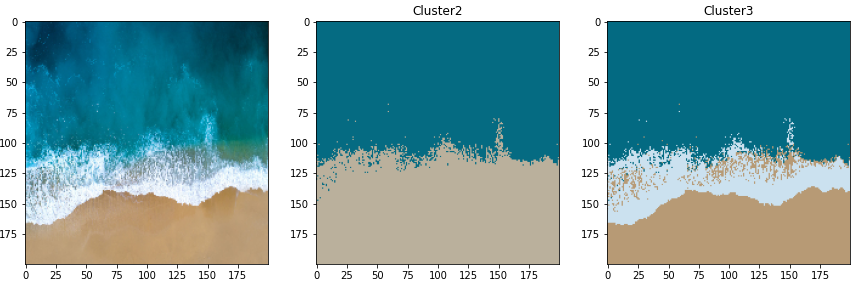
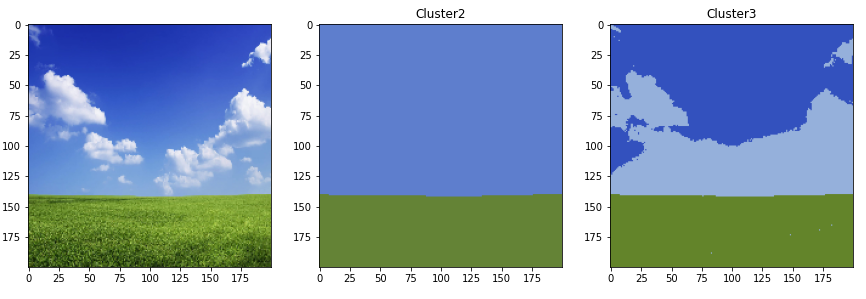
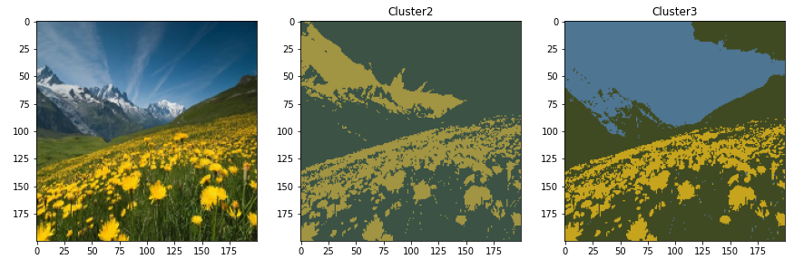
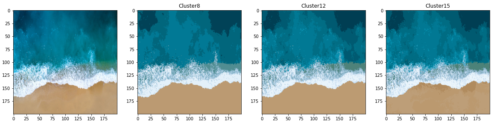
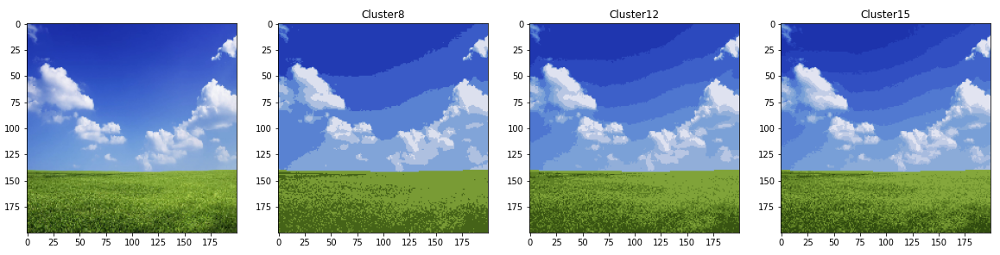
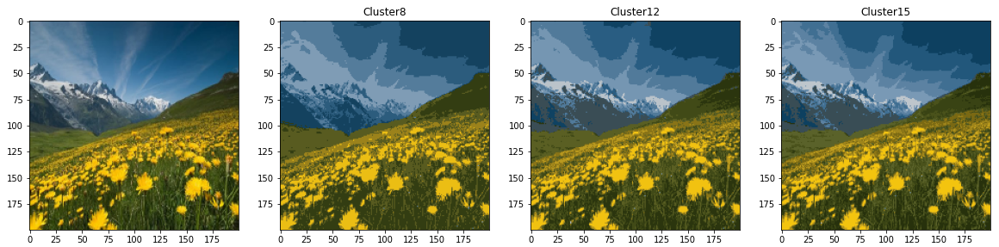
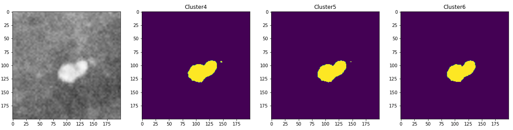
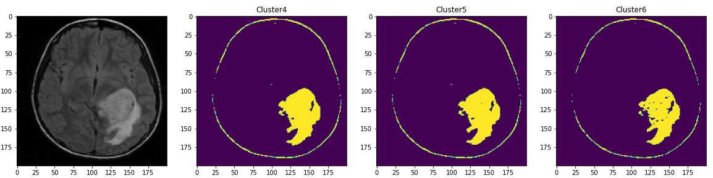
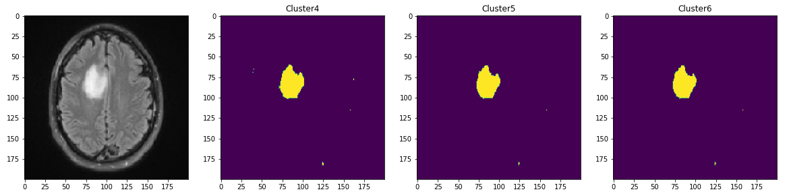
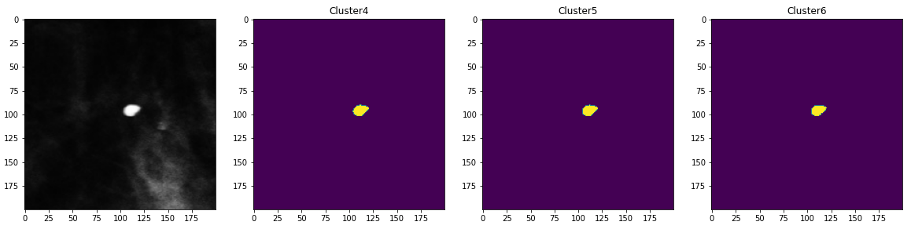

# Fuzzy clustering

### Opis:

Seminarski rad u okviru kursa računarska inteligencija.  
Segmentacija slika uz pomoć fuzzy klasterovanja.

### Eksperimentalni rezultati:

#### Slike u boji. 2-3 klastera:

#### Slike u boji. 4-6 klastera:

#### Detekcija tumora na mozgu. 4-6 klastera:

### Tehnologije korišćene za izradu:

  
  
  

### Autori:

- [Maja Crnomarković, 21/2017](https://github.com/crnomarkovicm)
- [Marko Babić, 77/2017](https://github.com/markobabic8)
