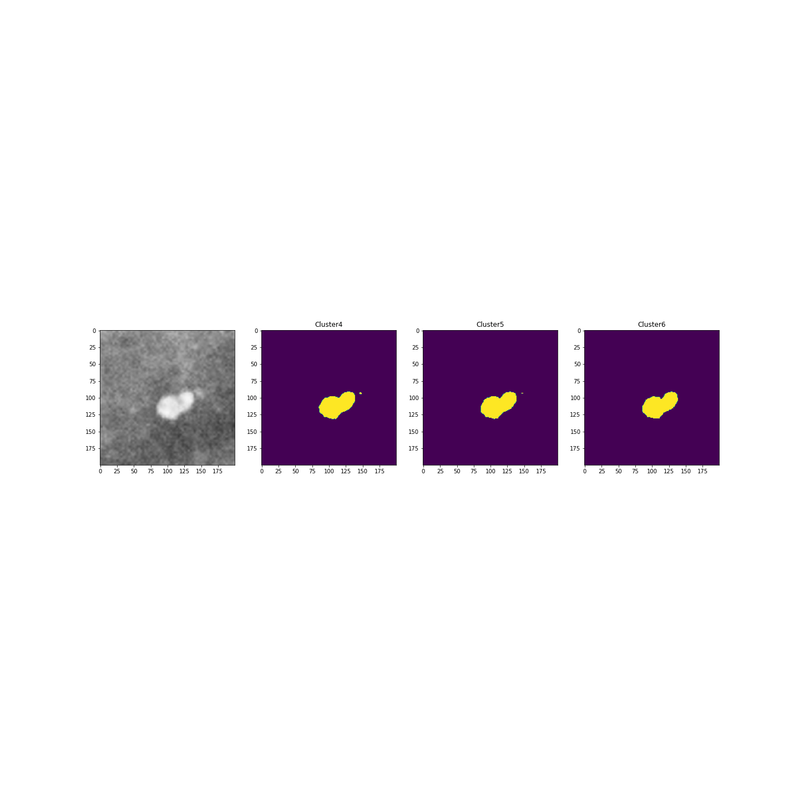

### Fuzzy clustering

# Opis:

Seminarski rad u okviru kursa računarska inteligencija.  
Segmentacija slika uz pomoć fuzzy klasterovanja.

# Eksperimentalni rezultati:

# Tehnologije korišćene za izradu:

  
  

# Autori:

- [Maja Crnomarkovic, 21/2017](https://github.com/crnomarkovicm)
- [Marko Babic, 77/2017](https://github.com/markobabic8)
